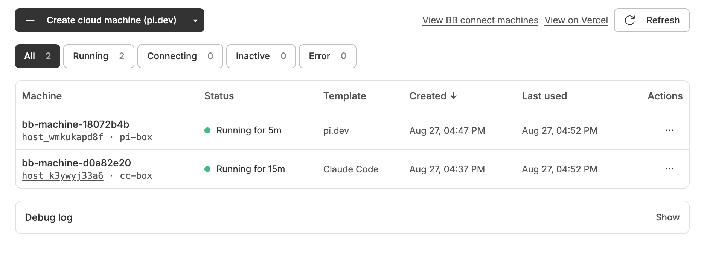
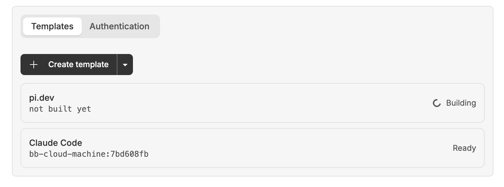

# bb-plugin-cloud-sandbox

**Cloud Machines** — spin up and manage cloud machines backed by
[Vercel Sandboxes](https://vercel.com/docs/vercel-sandbox).

Each cloud machine is a sandbox that installs bb and enrols itself over bb
connect, so it appears alongside your local machines and can run threads. The
interface is entirely graphical.

The package name stays `bb-plugin-cloud-sandbox` because the plugin id derives
from it; renaming would orphan the settings, secrets and database of every
existing install.

- **Cloud Machines page** — a table of machines with status, created and
  last-used times, sortable by name or either date and filterable by status.
  Each row shows the image it was created from and has a menu to wake, stop or
  delete it; plus create, manual refresh,
  links to bb's own machine settings and to the project's sandboxes on
  vercel.com, and a collapsible debug log.
- **Settings** — two tabs: **Templates** (what a machine is made of) and
  **Authentication** (the Vercel account).



Create a machine from the template named on the button, or pick another from
the chevron. Each row shows which template it came from, how long its current
session has been up, and links to bb's own page for that machine.

## Setup

```sh
bb plugin install .
```

Then open the plugin's settings page and click **Sign in with Vercel**. That
is the whole setup: approve the device code in the browser tab that opens, and
the plugin resolves your Vercel team and creates a sandbox project if you do
not already have one.

There is no CLI to install, no access token to copy, and no team or project id
to look up. The session refreshes itself, so the sign-in is one-time.

## Configuration

Everything is optional and lives in the plugin's settings page.

| Setting | Default | Purpose |
| --- | --- | --- |
| `machineTimeoutSeconds` | `2700` | How long a machine lives before Vercel terminates it |
| `machineVcpus` | `2` | vCPUs per machine (2 GB memory each) |
| `templateSecrets` | — | Managed by each template's agent credentials; do not edit by hand |
| `vercelSession` | — | Managed by the sign-in flow; do not edit by hand |

Vercel caps sandbox lifetime at **45 minutes on Hobby** and 24 hours on
Pro/Enterprise, with exceeding it failing sandbox creation outright
(`timeout should be <= 45m`). The default is the Hobby ceiling, which every
plan accepts; raise it if your team is on Pro.

**A cloud machine is therefore not long-lived.** Vercel terminates it at that
limit whatever it is doing, and the machine goes `Inactive`. This is a
property of the platform, not something the plugin can extend.

## Development

```sh
bb plugin dev        # rebuild + reload on every save
npm run typecheck
npm run build
bb plugin logs cloud-sandbox -f
```

## Layout

| File | Role |
| --- | --- |
| `machines.ts` | Cloud machine lifecycle: create, enrol, list, stop, wake, delete. No bb dependency. |
| `templates.ts` | Template presets, the Dockerfile, the image build, and registry cleanup. No bb dependency. |
| `agents.ts` | Agent providers and the credentials each one reads. No bb dependency. |
| `auth.ts` | Vercel OAuth device authorization (RFC 8628). No bb dependency. |
| `server.ts` | Settings, RPC, sign-in orchestration, template and machine state, debug log. |
| `app.tsx` | The Cloud Machines page and the settings tabs. |

## Agent credentials

Each template holds its own credentials, edited on its page. They are listed
by agent provider — Claude Code and pi.dev — each showing whether it is
configured, and each opening to its own fields. Claude Code takes a long-lived
OAuth token from `claude setup-token`; pi.dev takes an API key per model
provider, which it reads from the matching environment variable. Everything set
here is injected into a machine's environment **when the machine is created**.

This is the distinction the template concept exists to draw. A build-time
variable is baked into the image and readable by anyone who can pull it; a
secret is handed to the machine at creation and never enters a layer. Both
belong to the template, so a credential travels with the thing that defines
the machine rather than sitting plugin-wide.

Secrets are stored as one JSON secret setting keyed by template id, so they
land in the plugin's 0600 secrets directory rather than its database. They are
write-only from the UI: the backend reports which keys are set and never
returns a value, and it refuses a key no supported provider reads, since that
would be stored and injected while nothing ever consumed it. Machines created
before a credential is set do not receive it.

## Templates



A template is what a cloud machine is made of: an image, plus the credentials
its machines are given. The image bakes bb's prerequisites and your own setup
so a machine starts without repeating that work; the credentials are injected
when the machine is created and never enter a layer.

**Create template** starts from a preset — Blank, Claude Code, or
[pi.dev](https://pi.dev). A preset only seeds a new template's name, commands
and variables; it is ordinary editable configuration afterwards, not a link
that keeps updating. Each template has a name, a block of custom commands, and
build-time environment variables; building publishes its image to the container
registry and the template becomes `Ready`.

Every image starts from `docker.io/library/ubuntu:26.04` and installs bb's
prerequisites first: Node (the host daemon needs 22.19+ and the stock base
ships none) and a C toolchain (bb-app's `node-pty` is a native add-on built
from source at enrolment). Custom env vars are declared before the custom
commands so those commands can use them, and they persist into the running
machine.

Build-time env vars are baked into the image and visible to anyone who can
pull it, so credentials do not belong among them — those are a template's
agent credentials, injected per machine instead. A variable left **blank** is
a checklist entry and is not written into the image at all: emitting
`ENV KEY=""` would bake an empty string that shadows whatever the machine is
given at runtime.

Templates and their build logs live in the plugin's SQLite database rather
than `bb.storage.kv`, because a build log routinely exceeds the 256KB kv value
cap.

**Creating a machine** uses the template most recently used, changeable from
the chevron beside the button; the dropdown also offers "No template" for
Vercel's default managed image, and is available whether or not any template
exists. The chevron is a picker, not an action menu — choosing an entry only
changes what the button will do, and nothing is created until the button is
pressed. The selection follows the server's default until the user picks one,
so a background refresh cannot silently change what the button would create.

Deleting a template removes it, its build history and its credentials from bb
**and deletes its image from the container registry**. Only the latest hash of
each template's image is kept: pushing a tag that already exists leaves the
manifest it replaced behind, untagged and at full size, so every successful
build prunes untagged manifests afterwards. One development rebuild had
already stranded 470MB this way.

Registry cleanup goes through `api.vercel.com/v1/vcr/...` rather than the
`vercel vcr` CLI, so it needs no container tooling. Two things about that API
are worth knowing: it rejects the project *slug* that `inferScope` returns and
the sandboxes API accepts, so the plugin resolves the `prj_` id via
`/v9/projects/<slug>` and caches it; and deletion addresses an image id, not a
tag, so the repository is listed to find the manifest a tag points at. Every
cleanup failure is recorded in the debug log rather than failing the build or
deletion that triggered it.

Baking bb's prerequisites cuts enrolment from about **49s to 29s** measured
between the `create.sandbox-ready` and `create.enrolled` debug events, so a
template is a modest speedup rather than a prerequisite — machines can be
created without one.

The rest of the time cannot be baked away. Enrolment downloads a 37MB
`bb-app.tgz` from the bb server (~24s over a connect tunnel) and installs it
with native add-on builds (~15s), and `install.sh` deliberately reinstalls the
server's own build every time: "version strings cannot distinguish unpublished
builds, so an existing bb-app is trusted only when the server provides no
package (404) or is unreachable."

## Building custom images

Vercel Sandbox boots from OCI images in
[Vercel Container Registry](https://vercel.com/docs/sandbox/concepts/images).
Neither the SDK nor this plugin's host can build one directly — `vercel vcr
build`/`push` shell out to docker, podman or buildah — so images are built
**inside a throwaway sandbox**. That pipeline is verified end to end; three
things about it are not obvious:

1. **`buildah bud --isolation chroot` is required.** The default isolation
   tries to create a container namespace and fails inside a microVM with
   ``mount `proc` to `proc`: Operation not permitted``. `FROM`/`COPY` work
   without it, but no `RUN` step does.
2. **`vercel/sandbox/ubuntu` is not pullable.** It is a Vercel-internal
   shorthand for `Sandbox.create({ image })`, and
   `vcr.vercel.com/vercel/sandbox/ubuntu` returns 404. Custom images use a
   stock base such as `docker.io/library/ubuntu:26.04`, which matches what the
   managed image runs.
3. **The image is only a filesystem.** Vercel Sandbox does not run a Docker
   `ENTRYPOINT` or `CMD`, so there is no init contract to satisfy.

The registry is `vcr.vercel.com`, images live at
`<teamSlug>/<projectId>/<repo>:<tag>`, and `vercel vcr login buildah`
authenticates with the plugin's own OAuth token.

## How enrolment works

A machine runs bb's own installer, the same one behind **Settings → Machines →
Add a machine**. Three things about doing that inside a sandbox are not
obvious, and each was found by watching a real enrolment fail:

1. **`build-essential`** — the Vercel universal image ships Node but no C
   toolchain, and bb-app's `node-pty` dependency is compiled from source.
   Without it the install dies at `not found: make`.
2. **`BB_INSTALL_SKIP_SERVICE=1`** — the installer's final step registers a
   systemd user service, and containers have no systemd (`systemctl: not
   found`). This flag leaves the already-joined daemon running as a plain
   `nohup`'d process, which is what a disposable VM wants.
3. **The bb connect tunnel URL** — bb listens on loopback by default, and a
   sandbox on the public internet cannot reach `127.0.0.1`. The enrolment
   uses the public `serverUrl` that bb connect mints with the machine code, so
   **the connect plugin must be enabled and paired.**

Enrolment takes roughly a minute, most of it installing the toolchain and
building native modules, so a new machine sits at `Connecting` for a while.

## Notes

- **Deleting a sandbox does not delete its snapshots.** They outlive it and go
  on counting against Snapshots Storage with no sandbox left to reach them, and
  `sandbox.listSnapshots()` cannot see them either — only a project-wide list
  such as `vercel sandbox snapshots list` reveals them. Every path that
  disposes of a sandbox permanently goes through `deleteSandboxWithSnapshots`,
  including image builds, whose throwaway build VM stranded roughly its own
  image size on every build until this was fixed.
- Machines are created with `keepLastSnapshots: { count: 1 }`. Vercel appears
  to keep one snapshot per sandbox anyway, so this states the invariant the
  plugin relies on rather than saving anything; waking needs only the most
  recent snapshot. Snapshot storage grows with the *number* of machines, not
  with how often one is stopped, so deleting machines is what reclaims it.
- A template can create machines whenever it has ever built successfully,
  which is tracked by `imageRef` rather than by status. A failed rebuild leaves
  the published image untouched, so it must not strand a working template.
- Every run boots a fresh sandbox and stops it in a `finally` — a leaked
  sandbox keeps billing until its own timeout fires.
- `auth.ts` implements the device grant directly rather than calling
  `@vercel/sandbox`'s `OAuth()`, whose client id is a module constant with no
  parameter or env override. Every function here takes an optional client id,
  so pointing the plugin at your own registered Vercel integration means
  changing `DEFAULT_CLIENT_ID` in `auth.ts`.
- The access token and refresh token live in a single `secret` setting, so
  they are stored in the plugin's 0600 secrets directory rather than in
  `bb.db`. They are written through `bb.sdk.plugins.updateSettings`, because a
  settings handle is read-only by design.
- `inferScope` is called with `cwd` pinned to a temp directory. It otherwise
  reads `.vercel/project.json` relative to `process.cwd()` — wherever the bb
  server was launched — and could silently adopt an unrelated linked project.
- "image" survives in the code only where it means the OCI artifact a template
  builds — `imageRef`, `buildImage`, the registry helpers — and in migration
  SQL, which has to keep naming the columns it originally created. Everything
  that means the plugin concept is a template.
- The debug log is capped at 200 events to stay under the 256KB
  `bb.storage.kv` value cap. Nothing reads it to make decisions; it exists to
  answer "what did this plugin ask Vercel and bb to do, and when".
- Status is derived, not stored: Vercel is the authority on whether the
  sandbox is up, and bb's host registry is the authority on whether the
  machine actually connected. A sandbox that is `running` but whose host is
  not `connected` is still `Connecting`.
- There is no push event for a machine ending, so a disconnect is recorded
  when a refresh first observes it.
- A disconnect keeps both the local record and the bb host. The daemon's
  durable `hostId`/`hostKey` live in the sandbox filesystem
  (`~/.bb-machines/<server>/auth.json`), so deleting the bb host would
  invalidate them. A `disconnected` host is the correct state for a machine
  that is off but could come back — the same state bb shows for a sleeping
  laptop. Only an explicit **Remove** deletes the host and the record.
- **Waking** resumes a stopped machine. Vercel
  [persists sandboxes by default](https://vercel.com/docs/sandbox/concepts/persistent-sandboxes):
  stopping snapshots the filesystem and resuming boots **a new session** from
  that snapshot, with a **fresh session timeout**. So the durable `hostId` and
  `hostKey` in `~/.bb-machines` survive and the machine returns under the same
  bb host id — but **only the filesystem is restored, not running processes**.
  The docs are explicit about this: `onResume` exists "to restart background
  services". Waking therefore has to relaunch the host daemon itself, which is
  what the wake script does. It discovers the data directory on disk rather
  than deriving it from a server URL, because bb connect can mint a different
  tunnel URL than the machine originally enrolled against.
- The wake script checks liveness against the daemon's own
  `http://127.0.0.1:<port>/status` endpoint — the same signal bb's installer
  waits on — and returns only once it reports `connected`. Do **not** check
  with `pgrep -f "bb-app host-daemon"`: that pattern also matches the shell
  running the script, because it appears in that shell's own command line, so
  it always reports a running daemon and the relaunch never happens.
- Row actions live in one menu and stay visible when they do not apply, so the
  menu reads the same for every row. Wake is enabled only for `Inactive`
  (a `failed`/`aborted` sandbox has no session to resume) and Stop only for
  `Running`/`Connecting`.
- **Stop** and **Delete** are different operations. Stop ends the sandbox but
  keeps the record and the bb host, so the machine stays listed as `Inactive`
  and can be woken later. Delete is not reversible: it deletes the Vercel
  sandbox and every snapshot belonging to it, deletes the bb host, drops the
  local record, and hides the row. It is styled destructively and asks for
  confirmation, naming exactly what will be deleted.
- The "View on Vercel" link is `https://vercel.com/<teamSlug>/<project>/sandboxes`.
  `inferScope` returns a slug-shaped `projectId` for the default project, which
  is what that path wants; an explicitly linked project supplies a real
  `projectSlug` instead. Without a team slug the link is hidden rather than
  guessed.
- Deleting snapshots matters more than it looks. Stopping a sandbox can
  produce one even when `persistent` was never requested, and they are not
  small — a single machine left a 937 MB snapshot behind during development.
  Remove deletes them; Stop deliberately does not, because a snapshot is what
  a future wake would restore from.
- Removal order is deliberate: stop, then delete snapshots, then delete the
  sandbox. `delete()` leaves the instance inert, so listing snapshots
  afterwards would throw. A snapshot that will not delete is reported in the
  debug log rather than blocking the rest of the removal.
- The confirmation uses `Dialog`, not `AlertDialog`. bb's vendored Dialog
  renders through `ResponsiveDrawerShell`, so it becomes a bottom drawer on
  compact viewports; the registry's AlertDialog has no such treatment, and
  bb's UI guidance requires the responsive drawer for every compact dialog.
- Removing is the *only* way a row leaves the list. The list is derived from
  `Sandbox.list()`, and Vercel keeps returning stopped sandboxes indefinitely,
  so removed names are held in a bounded `dismissed` set in `bb.storage.kv`
  and filtered out.
- A row is titled by its **sandbox name**, with the bb host id as a subtitle.
  The host id links to bb's own page for that machine
  (`/settings/machines/<hostId>`, bb's `SETTINGS_MACHINE_ROUTE_PATH`), which
  exists for as long as the machine is enrolled — including while it is
  stopped, and not after it is deleted.
  The sandbox name is the one identifier this plugin owns; bb's host *name*
  is the container's hostname, which a resumed sandbox may not keep.
- "Running for X" is measured from the machine's **current session**, not from
  when the sandbox was created. Waking boots a new VM from the filesystem
  snapshot, so creation time would count the hours a machine spent stopped.
  The session start comes from `listSessions()`, matched against the
  `currentSessionId` the sandbox list reports; that costs one request per
  *running* machine, so stopped machines — which have no uptime to show — are
  not queried.
- "Last used" is bb's `lastSeenAt` for the machine's host — when bb last heard
  from the daemon — falling back to Vercel's sandbox `updatedAt` for a machine
  that never connected. A machine with no last-used time sorts last in either
  direction rather than jumping between ends of the table.
- The table is capped at 26rem and scrolls, with a sticky header, so a long
  list cannot push the debug log off the page.
- Listing machines costs a Vercel round trip for the sandbox list plus two
  more per *running* machine to read its session start, so a cold read takes
  over a second and grows with the fleet. Answers are cached for 30s and
  served **stale while a refresh runs behind them**: a cold read is ~1.4s, a
  warm one ~4ms, and a stale one returns in ~50ms with `refreshing: true` so
  the page can say so quietly. Anything the plugin changes drops the cache, so
  acting on a machine never leaves a stale answer on screen. Manual Refresh
  passes `force` and bypasses it entirely.
- The nav panel unmounts when you navigate away, so the last answer is also
  held in a module-level variable in the frontend. That lets a revisit paint
  its previous contents at once rather than showing "Loading…" from scratch;
  the server cache is what makes the refresh behind it cheap.
- Being signed out is deliberately **not** reported through
  `bb.status.needsConfiguration`. BB only loads a plugin's frontend while its
  status is exactly `running`
  (`apps/app/src/lib/plugin-frontend.ts`), so that status removes every slot
  the plugin registers — the Cloud Machines nav entry, and the settings
  section holding the **Sign in with Vercel** button that a signed-out user
  needs to reach. The page reports the state itself and links to that tab.
- The page polls every 45s while it is open, and the interval is cleared on
  unmount. Overlapping refreshes are suppressed so a slow list cannot stack
  up behind the timer.
